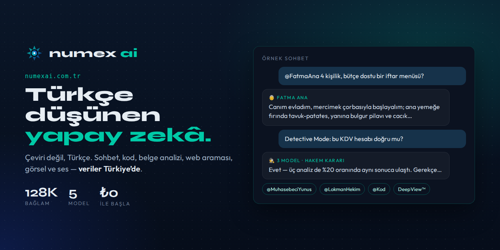
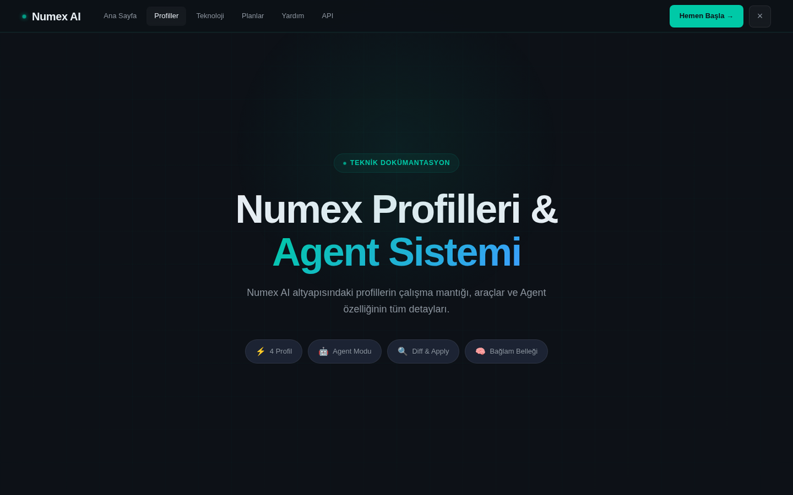
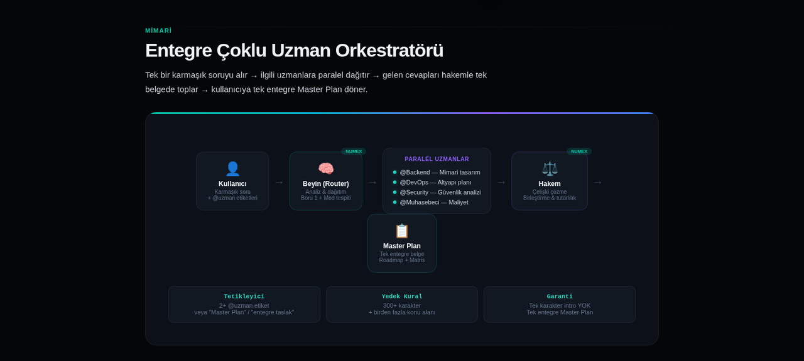

# ◆ Numex AI

### Türkçe düşünen yapay zekâ — insanı önce koyan Türk yapay zekâsı.

**Sohbet · Kod · Belge analizi · Web araması · Görsel · Ses · Karakterler · Detective Mode™**

---

> *"Türkçe konuşan, Türk kültürünü anlayan bir yapay zekâ neden yok?"* — Numex bu soruyla 2021'de
> İstanbul'da yola çıktı. **Çeviri değil, Türkçe:** her yanıt Türkçe'ye özel 5 katmanlı bir
> Pipeline'dan geçer. Hedef, *"yapılmaktadır"* değil *"yapılır"* diyen bir yapay zekâ.

**Kayıt olmadan dene** (günde 5 mesaj) · **Ücretsiz plan** (günde 15 mesaj) · Google / GitHub ile tek tıkla giriş · Telefona uygulama olarak ekle (PWA)

**Türkçe sohbet, kod, görsel, ses, belge analizi ve web araması — tek arayüzde.**
🔗 [numexai.com.tr](https://numexai.com.tr)

*"Merhaba, ben Numex AI — Türkçe odaklı çalışma arkadaşınız: kod, araştırma ve belge analizi." `@` ile uzman/karakter seçimi, hızlı başla önerileri, Numex Auto model seçici, sesli giriş.*

## Ne yapar?

| Yetenek | Açıklama |
|---|---|
| 💬 **Türkçe sohbet** | Pipeline'dan geçen, doğal ve günlük Türkçe yanıtlar. |
| 💻 **Kod** | Kod yazma, açıklama, debug; canlı önizlemeli **Canvas** alanı ve syntax highlighting'li Codex editörü. |
| 📄 **Belge analizi** | PDF ve Word dosyalarını özetleme, soru sorma, karşılaştırma. |
| 🌐 **Web arama modu** | Güncel bilgiyi arayıp kaynaklı özet; chip seçicilerle mod değişimi. |
| 👁️ **Görsel anlama** | Numex Vision profiliyle görsel analiz ve açıklama. |
| 🎙️ **Sesli giriş & konuşma** | Sesli komut ve sesli sohbet oturumları. |
| 🇹🇷 **Karakterler** | `@FatmaAna`, `@LokmanHekim`, `@MuhasebeciYunus`… ([ayrıntı](https://github.com/numexai/numex_nedir/blob/main/urunler/08-karakterler.md)) |
| 🕵️ **Detective Mode™** | Kritik sorularda çoklu model + hakem. |
| 🔬 **DeepView™** | Çoklu uzmanla "Master Plan" ve 6 katmanlı düşünce görünümü. |
| 🤖 **Agent modu** | Çok adımlı görevleri planlar, değişiklikleri diff olarak sunar. |
| 🔗 **Paylaşılabilir sohbetler** | Sohbet linkini başkalarıyla paylaşın. |
| 🔔 **Bildirimler** | Uygulama içi güncelleme ve duyurular. |

## Deneyim

- **Kayıt olmadan dene:** Misafir olarak günde 5 mesaj.
- **Tek tıkla giriş:** Google veya GitHub OAuth.
- **PWA:** Giriş yaptıktan sonra telefon veya masaüstüne uygulama olarak ekleyin.
- **Temalar:** Lacivert (varsayılan), Açık, Açık Sade, Sistem.
- **Erişilebilirlik:** Yüksek kontrast, büyük yazı, ekran okuyucu desteği.
- **Mobil öncelikli** tasarım; klavye açıldığında kayma gibi mobil sorunlar v3.1'de giderildi.

## Profiller

| Profil | Ne zaman? |
|---|---|
| 🧠 **Numex Pro** | Uzun bağlam (128K), derin analiz, karmaşık görevler |
| ⚡ **Numex Fast** | Hızlı sohbet, kısa görevler |
| 👁️ **Numex Vision** | Görsellerle çalışma |
| 💻 **Numex Code** | Debug, refactor, test, dokümantasyon |

Arayüzdeki profil, planınıza göre sunucu katmanında uygun işlem hattına otomatik yönlendirilir.

## Örnek kullanımlar

- *"Bu sözleşmedeki fesih maddelerini özetle"* → belge analizi
- *"@MuhasebeciYunus şahıs şirketinde KDV beyannamesi ne zaman verilir?"*
- *"@FatmaAna 4 kişilik, bütçe dostu bir akşam menüsü"*
- *"React componentimde neden memory leak oluşuyor?"* → Detective Mode
- *"@Backend @DevOps @Security bu SaaS için entegre taslak çıkar"* → DeepView Master Plan

## Agent modu

## 💳 Planlar

Ücretsiz (₺0) · Başlangıç PRO (₺99) · Numex PRO (₺399) · Advanced (₺599) + kredi paketleri ve
zaman bazlı biletler. → [Ana sayfadaki plan tablosu](#-planlar)

## ⚡ Numex'i farklı kılan

| | |
|---|---|
| ⚡ **Pipeline** | Prompt güçlendirme → model → Türkçe düzeltme & ton → kalite kontrol → yanıt |
| 🕵️ **Detective Mode™** | Kritik sorularda birden çok model çözer, hakem en doğrusunu **gerekçesiyle** seçer |
| 🤖 **Multi-Agent** | Karmaşık isteği uzman ajanlara böler, tek tutarlı yanıtta birleştirir |
| 🔬 **DeepView™** | 2+ `@uzman` ile tek bir *Master Plan*; yapay zekânın düşüncesi 6 katmanda |

## 🇹🇷 Karakterler

`@FatmaAna` (mutfak, ev) · `@MuhasebeciYunus` (KDV, beyanname, e-fatura) · `@LokmanHekim` (sağlıklı yaşam) ·
`@HaciBayramHoca` (maneviyat) · `@Üstat` · `@Avukat` · `@Kod`

## 🔒 Gizlilik

Veriler Türkiye'de, KVKK uyumlu; her biri 256 GB RAM'li çift sunucu mimarisi.
Ödemeler İyzico ile; kart bilgisi Numex'te saklanmaz.

## 👨‍👩‍👧‍👦 Numex Ailesi

Aynı akıl, birçok kapı: 🧩 [Codex](https://github.com/numexai/numex-codex) · ⌨️ [CLI](https://github.com/numexai/numex-cli) ·
🔌 [API](https://github.com/numexai/numex-api) · 🧰 [SDK](https://github.com/numexai/numex-sdk) ·
🎓 [Okul](https://github.com/numexai/numex-okul) · 🛍️ [Market](https://github.com/numexai/numex-market) ·
📖 [Numexpedia](https://github.com/numexai/numex-pedia) · 📦 [Hub](https://github.com/numexai/numex-hub) ·
🏗️ [Forge](https://github.com/numexai/numex-forge) · 🧭 [Pusulam](https://github.com/mobilcep/pusulamx) ·
🩺 [PC Doktoru](https://github.com/mobilcep/pcdoktoru)

---

**Numex Ailesi** · [Numex AI](https://numexai.com.tr) · [Codex](https://github.com/numexai/numex-codex) · [Okul](https://github.com/numexai/numex-okul) · [Market](https://market.numexai.com.tr) · [Numexpedia](https://github.com/numexai/numex-pedia) · [Hub](https://github.com/numexai/numex-hub) · [Forge](https://github.com/numexai/numex-forge) · [API](https://github.com/numexai/numex-api) · [SDK](https://github.com/numexai/numex-sdk) · [Pusulam](https://github.com/mobilcep/pusulamx) · [PC Doktoru](https://github.com/mobilcep/pcdoktoru)

*İnsanı önce koyan Türk yapay zekâsı* 🇹🇷 · [Tüm ekosistem →](https://github.com/numexai/numex_nedir)

